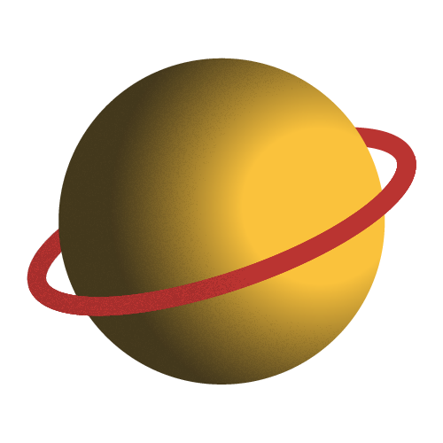

## N-Body Simulator

An N-Body simulator in vanillaJS and a canvas 🖼

See it live @ [zeyu-li.github.io/black-hole](https://zeyu-li.github.io/black-hole/)

## About

For Astro 101

View the website live by clicking the link above!

### Artwork

All artwork was done my @[Zeyu Li](https://github.com/Zeyu-Li)

### Code

All code is open source and done without any dependencies or resources

## License

